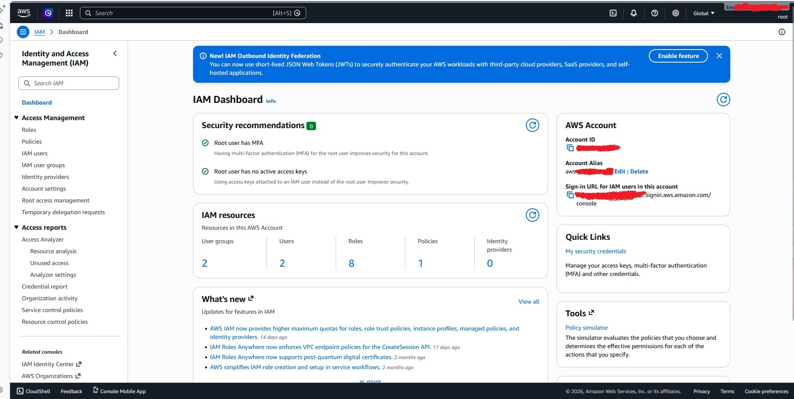

# aws-cloud-practitioner-studies
Notes, concepts, and hands-on labs for the AWS Certified Cloud Practitioner certification.

## Section 1: Introduction to Cloud ☁️
Cloud computing is the on-demand delivery of compute power, database, storage, and other IT resources via the internet with pay-as-you-go pricing.

**Key Benefits:**
* **Go Global in minutes:** Deploy applications worldwide.
* **Stop guessing capacity:** Scale up/down as needed.
* **Trade Capital Expense for Variable Expense:** Pay only for what you consume.

---

## Section 2: AWS Global Infrastructure 🌎
AWS is organized into a massive global network. Here is how it works:

### 1. AWS Regions
* **What it is:** A physical location in the world where AWS has multiple data centers (e.g., North Virginia, São Paulo).
* **The Goal:** You choose a region close to your users to reduce delays and comply with local laws.

### 2. Availability Zones (AZ)
* **What it is:** Think of an AZ as a "Fortress". Each Region has at least 3 AZs. 
* **The Goal:** They are physically separated from each other. If one AZ has a flood or power outage, the others keep your application running. **This is High Availability.**

### 3. Edge Locations (Points of Presence)
* **What it is:** These are like "Mini Data Centers" spread all over the globe (much more numerous than Regions).
* **The Goal:** They store a copy of your content (videos, images) closer to the final user. 
* **Analogy:** If your server is in the USA (Region) and your user is in Bahia, the user doesn't have to "travel" to the USA to get a photo. They get it from an **Edge Location** in Brazil. This is what we call **Low Latency** (high speed).

---

## Section 3: The Shared Responsibility Model 🛡️
Security and Compliance is a shared responsibility between AWS and the customer.

* **AWS (Security OF the Cloud):** Responsible for the physical infrastructure (Hardware, Software, Facilities).
* **Customer (Security IN the Cloud):** Responsible for data encryption, Identity Access Management (IAM), and network firewall configuration.

  ---

## 🔐 Section 4: Identity and Access Management (IAM)

### 1. Root Account Security & Identity Isolation Strategy
The master **Root Account** holds unrestricted, absolute privileges over the entire cloud infrastructure. Following AWS Security Best Practices, this identity must be isolated, protected with MFA, and strictly retired from daily administrative operations. 

  

* **The Break-Glass Strategy:** The Root account is treated as an emergency-only principal. It remains completely inert and is exclusively reserved for critical scenarios, such as incident response (e.g., locking compromised assets during a cyberattack), billing structure changes, or account recovery.
* **Operational Delegation:** Daily cloud administration is completely shifted to the newly provisioned IAM User Group. This delegated administrative layer holds the necessary execution power for day-to-day operations—including the creation and management of standard team users—without exposing the foundational master keys of the root environment.
